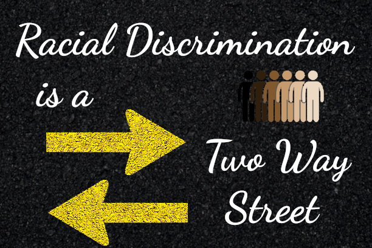

Hey there, folks! Today, let's dive into a pretty thorny topic that's been buzzing around workplaces for ages: racial discrimination. Now, I know what you're thinking – “Oh boy, here we go again.” But hang with me, because we're going to look at this from an angle that doesn't always get much airtime.

So, we all know racial discrimination is a huge problem in the workplace, right? It's like that annoying neighbor who just won't quit with the loud music at 2 AM. It's persistent, disruptive, and honestly, we're all pretty sick of it. But here's the kicker – it's not always what you might expect.

Traditionally, when we talk about racial discrimination, many people immediately picture white folks discriminating against people of color. And yeah, that absolutely happens, and it's a massive issue. But here's the thing – discrimination isn't a one-way street. It's more like a chaotic roundabout where anyone can end up going the wrong way.

Let's break it down a bit. In today's diverse workplaces, you've got people from all walks of life, all colors, all backgrounds. And guess what? They're all human, which means they're all capable of having biases and prejudices. Shocking, I know!

So picture this: You've got a team led by a manager who's a person of color. They might have faced discrimination in the past, which sucks big time. But that experience could potentially lead them to harbor some negative feelings towards white employees. Maybe they're less likely to consider them for promotions, or they're quicker to criticize their work. That's discrimination too, folks.

Or flip it around. A white employee might feel like they're walking on eggshells, afraid to speak up or disagree with colleagues of color for fear of being labeled racist. That's not a healthy work environment either. The point is, racial discrimination can come from any direction. It's not about pointing fingers or playing the blame game. It's about recognizing that we all have the potential to discriminate, often without even realizing it.

Now, I'm not saying all this to minimize the very real and systemic racism that people of color face. That's a huge problem that needs serious addressing. But if we're going to tackle workplace discrimination, we need to look at the whole picture.

So, what can we do about it? Well, for starters, we need to create workplaces where open, honest conversations about race can happen without fear. We need diversity training that goes beyond the basics and really digs into unconscious biases – all of them, not just white-on-minority biases.

We also need to hold everyone accountable, regardless of their race. Discrimination is discrimination, period. If we're serious about creating fair, equitable workplaces, we can't turn a blind eye to any form of it.

Look, at the end of the day, we're all just trying to do our jobs and maybe make a positive impact along the way. Racial discrimination, no matter who it's coming from or who it's directed at, gets in the way of that. It creates tension, erodes trust, and ultimately makes the workplace a pretty miserable place to be.

So let's commit to calling out discrimination wherever we see it, to checking our own biases (because trust me, we've all got 'em), and to creating workplaces where everyone – and I mean everyone – feels valued and respected.

It's not going to be easy, and it's definitely going to be uncomfortable at times. But hey, growth usually is. And I don't know about you, but I think it's about time we grew past this whole racial discrimination thing, don't you?

Alright, that's my two cents on the matter. What do you think? Have you seen or experienced discrimination going both ways in your workplace? Let's keep this conversation going in the comments. After all, talking about it is the first step to fixing it!

---

<aside>
🔊

To listen to an audio version of this blog post, click [here](https://paulsybrandy.com/blogaudio/audio/Breaking_Down_Racial_Discrimination-audio.wav). Conversely, you can visit the blog's audio website [here](https://paulsybrandy.com/blogaudio/), for audio versions of all my blog posts.

</aside>